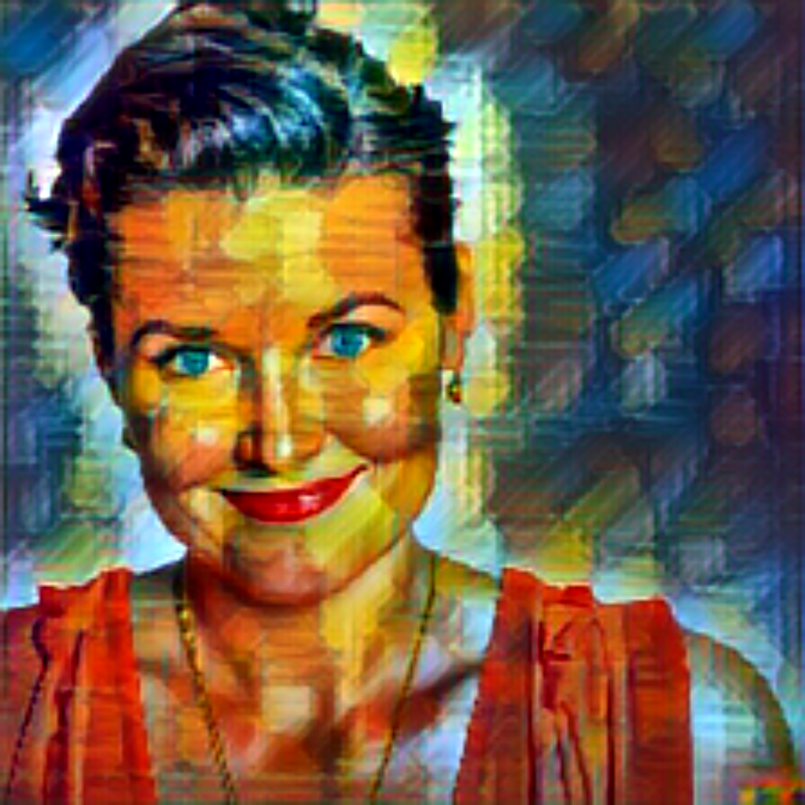

# STYLE TRANSFER CPP

C++ project that exploit ONNXRuntime to run style transfer models

Content                    |  Style                    |  Result                   |
:-------------------------:|:-------------------------:|:-------------------------:
  |   |  

### Avalilable styles:
1. Candy
2. Mosaic
3. Pointilism
4. Rain Princess
5. Udnie

## Dependencies:

1. OpenCv: `sudo apt install libopencv-dev python3-opencv`
2. ONNXRuntime: [ONNXRuntime installation and CMake integration](https://medium.com/@massimilianoriva96/onnxruntime-integration-with-ubuntu-and-cmake-5d7af482136a)
## Configuration

1. Preliminary step: `make prepare`
2. CMake configuration:
    - Debug: `make configuration_d`
    - Release: `make configuration_r`

## Build

`cmake --build ./build -j<cpu_count>`
